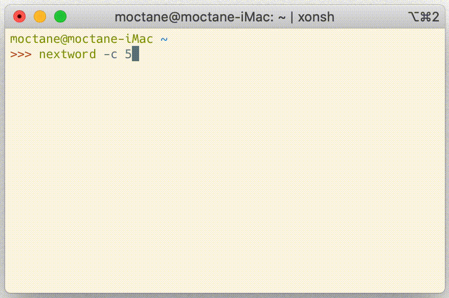

# Nextword
Predict a next English word.



## Installing

1. [**IMPORTANT**] Install [Nextword-data (https://github.com/high-moctane/nextword-data)](https://github.com/high-moctane/nextword-data)

2. Install this program (You need Go language compiler).

    ```bash
    $ go get -u github.com/high-moctane/nextword
    ```

## Usage

```
$ nextword -h
Nextword prints the most likely English words that follow the stdin sentence.

Usage of /Users/moctane/go/bin/nextword:
  -g
    	show as many result as possible
  -n
    	max candidates number (default 10)
  -d string
    	path to the data directory (default "/path/to/nextword-data")
  -h	show this message
  -v	show version

You need to install nextword-data and set "NEXTWORD_DATA_PATH" environment variable.
It available at https://github.com/high-moctane/nextword-data

The result depends on whether the input string ends with a space character.
If the string does not end with a space, nextword will print candidate words which
begin the last word in the sentence.

Example:
	input:  "Alice was "
	output: "not a the in still born very so to beginning too at sitting ..."

	input:  "Alice w"
	output: "was would were went with will who wrote when wants ..."
```

## Testing

For testing, you need to install nextword-data **LARGE** version and set
`NEXTWORD_TEST_DATA_PATH` environment variable in advance.

```
$ go test
```

## License

MIT
